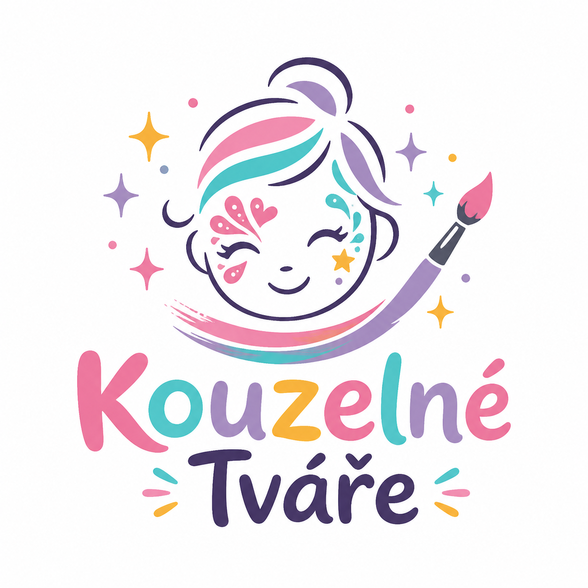

<div align="center">
  

  <h1>Kouzelné Tváře</h1>

  <p><strong>Malování na obličej pro dětské akce v Praze a okolí</strong></p>

  <p>
    
    
    
    
  </p>

  <p>
    <a href="https://kouzelnetvare.cz">🌐 kouzelnetvare.cz</a>
  </p>
</div>

---

## ✨ O projektu

Webová prezentace pro **Kouzelné Tváře** — malování na obličej pro dětské oslavy, školky a firemní family days v Praze a okolí. Stránka představuje služby, oblíbené motivy, ceník a příběh Martiny Škorubové, která za projektem stojí.

---

## 🗂 Struktura projektu

```
src/
├── App.tsx                    # Hlavní orchestrátor
├── styles.ts                  # Všechny styly na jednom místě
├── theme.ts                   # Barvy, typy, data, smoke testy
├── assets/
│   ├── logo.png               # Logo Kouzelné Tváře
│   └── martina.png            # Foto Martiny
└── components/
    ├── Header.tsx             # Navigace
    ├── HeroSection.tsx        # Hero sekce
    ├── ServicesSection.tsx    # Nabídka služeb
    ├── StorySection.tsx       # Příběh značky
    ├── AboutSection.tsx       # O Martině
    ├── MotifsSection.tsx      # Oblíbené motivy
    ├── PricingSection.tsx     # Ceník
    ├── HowItWorksSection.tsx  # Jak to probíhá
    ├── ContactSection.tsx     # Kontakt
    ├── Footer.tsx             # Patička
    ├── BrushIcon.tsx          # SVG ikonka štětce
    ├── Button.tsx             # Tlačítko (primary / outline)
    ├── Card.tsx               # Karta
    ├── LogoMark.tsx           # Logo komponenta
    └── SectionTitle.tsx       # Nadpis sekce
```

---

## 🚀 Lokální spuštění

```bash
npm install
npm run dev
```

Web bude dostupný na [http://localhost:5173](http://localhost:5173).

```bash
npm run build    # produkční build do /dist
npm run preview  # náhled produkčního buildu
```

---

## 🌍 Deployment

Web se automaticky nasazuje na **GitHub Pages** při každém push na větev `main` pomocí GitHub Actions.

Pipeline: `.github/workflows/deploy.yml`

Živá adresa: **[https://kouzelnetvare.cz](https://kouzelnetvare.cz)**

---

## 📬 Kontakt

✉️ [info@kouzelnetvare.cz](mailto:info@kouzelnetvare.cz)  
📞 +420 777 559 022  
📍 Praha 8 a okolí
